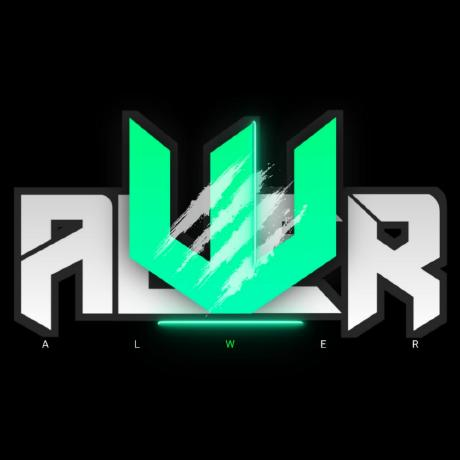

# Titanic Survival Prediction | پیش‌بینی بقای مسافران تایتانیک

<div align="center">
  
</div>

Machine Learning in Python — Mini Project 3
یادگیری ماشین در پایتون — پروژه کوچک شماره ۳

Predict whether a passenger survived the Titanic sinking, using the
[Kaggle Titanic dataset](https://www.kaggle.com/c/titanic).
پیش‌بینی اینکه آیا مسافری در غرق شدن تایتانیک زنده مانده است یا نه، با استفاده از
[دیتاست تایتانیک کگل](https://www.kaggle.com/c/titanic).

---

## Result | نتیجه

| Model | مدل | CV Accuracy | دقت اعتبارسنجی | CV Std |
|---|---|---|---|---|
| **XGBoost** | **XGBoost** | **83.24%** | **۸۳.۲۴٪** | 1.85 |
| Logistic Regression | رگرسیون لجستیک | 82.68% | ۸۲.۶۸٪ | 1.66 |
| Random Forest | جنگل تصادفی | 80.31% | ۸۰.۳۱٪ | 2.12 |
| Decision Tree | درخت تصمیم | 77.27% | ۷۷.۲۷٪ | 3.41 |
| KNN | نزدیک‌ترین همسایه | 70.75% | ۷۰.۷۵٪ | 1.57 |
| SVM | ماشین بردار پشتیبان | 68.51% | ۶۸.۵۱٪ | 1.83 |

**Baseline (always predicting the majority class): 61.75%**
**خط پایه (همیشه گفتن کلاس اکثریت): ۶۱.۷۵٪**

Cross-validated with `StratifiedKFold(n_splits=5, shuffle=True, random_state=42)`.
اعتبارسنجی متقاطع با پنج بخش انجام شده است.

---

## What the model learned | مدل چه چیزی یاد گرفت

The strongest signals in the data:
قوی‌ترین نشانه‌ها در داده:

- **Sex** — 74% of women survived, only 19% of men
  **جنسیت** — ۷۴٪ از زنان زنده ماندند، تنها ۱۹٪ از مردان
- **Pclass** — 63% survival in first class, 24% in third class
  **طبقهٔ مسافرت** — ۶۳٪ بقا در طبقهٔ اول، فقط ۲۴٪ در طبقهٔ سوم
- **Title** — extracted from `Name`; `Master.` marks a young boy, and
  children had priority seats in the lifeboats
  **عنوان** — از ستون `Name` استخراج شد؛ `Master.` یعنی پسر خردسال، و کودکان
  در قایق‌های نجات اولویت داشتند
- **Age** — children survived at a much higher rate than adults
  **سن** — کودکان نرخ بقای بسیار بالاتری از بزرگسالان داشتند
- **Family** — passengers travelling with family did better than those
  travelling alone
  **خانواده** — مسافرانی که با خانواده بودند بهتر از تنهاها عمل کردند

---

## Approach | رویکرد

1. **EDA** — shape, null counts, target balance, distributions
   بررسی ابعاد داده، مقادیر گمشده، توزیع هدف و توزیع ویژگی‌ها
2. **Visualisation** — histograms, correlation heatmap, survival-rate bars
   مصورسازی — هیستوگرام، هیت‌مپ همبستگی، نمودار نرخ بقا
3. **Preprocessing** — `FamilySize`, `IsAlone`, `Title` extraction,
   median imputation, one-hot and label encoding, age and family binning
   پیش‌پردازش — اندازه خانواده، تنها بودن، استخراج عنوان، پرکردن با میانه،
   کدگذاری یک‌داغ و برچسبی، گروه‌بندی سن و خانواده
4. **Modeling** — six algorithms compared on identical splits
   مدل‌سازی — مقایسه شش الگوریتم روی تقسیم‌های یکسان
5. **Evaluation** — 5-fold cross-validation plus `GridSearchCV` tuning
   ارزیابی — اعتبارسنجی متقاطع پنج‌بخشی به‌همراه تنظیم پارامترها
6. **Submission** — `submission.csv` in the Kaggle format
   خروجی — فایل `submission.csv` در قالب کگل

---

## Files | فایل‌ها

| File | فایل | Description | توضیح |
|---|---|---|---|
| `main.ipynb` | | The full notebook | نوتبوک کامل |
| `train.csv` | | Training data with the `Survived` label (891 rows) | داده آموزش با برچسب بقا |
| `test.csv` | | Competition data, no label (418 rows) | داده آزمون بدون برچسب |
| `sampleSubmission.csv` | | Expected output format from Kaggle | قالب خروجی کگل |
| `submission.csv` | | My predictions for `test.csv` | پیش‌بینی‌های من |
| `model_comparison.csv` | | Accuracy table for all six models | جدول دقت هر شش مدل |
| `assets/alwer.jpeg` | | Logo | لوگو |

---

## Submitting to Kaggle | ارسال به کگل

```bash
kaggle competitions submit -c titanic -f submission.csv
```

---

## Running locally | اجرای محلی

```bash
pip install pandas numpy matplotlib seaborn scikit-learn xgboost
jupyter nbconvert --to notebook --execute main.ipynb
```